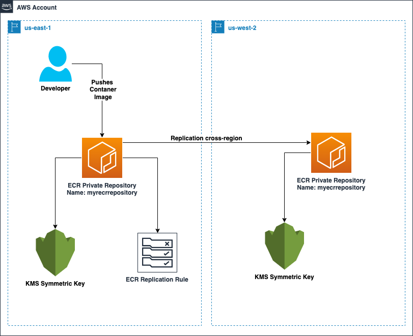

# ECR KMS Replication Automation

In this GitHub repository, we will provide step by step guidance to deploy a Amazon CloudFormation (CFN) template to automatically create all the resources and settings required to enable KMS encryption on Amazon Elastic Container Registry (ECR) with cross-region or cross-account replication. 

# Table of Contents

- [CloudFormation Templates](#cloudformation-templates)
  * [Cross-Region Replication](#cross-region-replication)
     * [Architecture Diagram](#architecture-diagram)
     * [Primary Region](#primary-region)
     * [Secondary Region](#secondary-region)
  * [Cross-Region and Cross-Account Replication](#cross-region-and-cross-account-replication)
     * [Architecture Diagram](#architecture-diagram-1)
     * [Primary Account and Region](#primary-account-and-region)
     * [Secondary Account and Region](#secondary-account-and-region)
  * [Clean Up](#clean-up)
- [License](#license)
     

# CloudFormation Templates

## Cross-Region Replication

### Architecture Diagram

### Primary Region
For Cross-Region replication, but within same account, please follow steps below for deploying the Cloudformation into your AWS account:
1. Clone this Git repository to your local machine (if you haven't already done)
2. Navigate to the `cross-region-same-account/primary-region` folder on this repo
3. Open the AWS Console on the primary account and region (i.e us-east-1)
4. Choose `Create stack`
5. Under `Specify Template`, do the following:
    1. Choose `Upload a template file`
    2. Rhen choose `Choose file` 
    3. Navigate to the folder on your local machine where you cloned this repository
    4. Select the `primary-region-template.yaml` file 
6. Choose `Next`
7. Under `Stack Name` enter a name for your stack (i.e. "Primary ECR Repo")
8. Under `Parameters` do the following:
    1. For `ECRDestiationRegion` enter the AWS region you'd like ECR to replicate your images. _This will also be the region where you'll run the second CloudFormation Tempalte._
    2. For `ECRRepositoryName`, enter the name of the ECR repository. _The name must start with a letter and can only contain lowercase letters, numbers, hyphens, underscores, periods and forward slashes_
    3. For `KMSKeyAdmin` enter the IAM Principal ARN that you'd like to be the KMS Admin
    4. For `KMSKeyUser` enter the IAM Principal ARN that you'd like to consume the KMS key (i.e. push/pull images from ECR)
9. Choose `Next`
10. Choose `Next` again
11. Finally, choose `Submit`
12. Your CloudFormation template will deploy all the required resources for your primary region

### Secondary Region
Now, it is very important that before we push any images to our ECR repository that we create the ECR repository in our secondary region. 

**_Do NOT push an image to your primary repository before following steps below. If you push an image to the primary ECR repository region without creating the ECR repository destination, the ECR destination repository will NOT have KMS encyrption)_** 
1. Clone this Git repository to your local machine (if you haven't already done)
2. Navigate to the `cross-region-same-account/secondary-regions` folder on this repo
3. Open the AWS Console on the primary account and region (i.e us-east-1)
4. Choose `Create stack`
5. Under `Specify Template`, do the following:
    1. Choose `Upload a template file`
    2. Rhen choose `Choose file` 
    3. Navigate to the folder on your local machine where you cloned this repository
    4. Select the `secondary-region-template.yaml` file 
6. Choose `Next`
7. Under `Stack Name` enter a name for your stack (i.e. "Secondary Destination ECR Repo")
8. Under `Parameters` do the following:
    1. For `ECRRepositoryName`, enter the name of the ECR repository. _The name must start with a letter and can only contain lowercase letters, numbers, hyphens, underscores, periods and forward slashes_ _The name MUST be exactly the same as your primary region, if they don't match, replication with KMS encryption will NOT work_ 
    2. For `KMSKeyAdmin` enter the IAM Principal ARN that you'd like to be the KMS Admin
    3. For `KMSKeyUser` enter the IAM Principal ARN that you'd like to consume the KMS key (i.e. push/pull images from ECR)
9. Choose `Next`
10. Choose `Next` again
11. Finally, choose `Submit`
12. Your CloudFormation template will deploy all the required resources for your primary region

You can now test your ECR replication with KMS encryption enabled on both repositories. Just push a container image to the primary repository region (in this example us-east-1). After the image is pushed, you can navigate to the secondary ECR repository region (in this example us-west-2), and you will see the image automatically replicated and with KMS key encryption. 

## Cross-Region and Cross-Account Replication

### Architecture Diagram

### Primary Account and Region 
For Cross-Region and Cross-Account replication, please follow steps below for deploying the Cloudformation into your AWS account and in the primary account and region:
1. Clone this Git repository to your local machine (if you haven't already done)
2. Navigate to the `cross-region-cross-account/primary-account` folder on this repo
3. Open the AWS Console on the primary account and region (i.e us-east-1)
4. Choose `Create stack`
5. Under `Specify Template`, do the following:
    1. Choose `Upload a template file`
    2. Rhen choose `Choose file` 
    3. Navigate to the folder on your local machine where you cloned this repository
    4. Select the `primary-region-cross-account-template.yaml` file 
6. Choose `Next`
7. Under `Stack Name` enter a name for your stack (i.e. "Primary ECR Repo")
8. Under `Parameters` do the following:
    1. For `ECRDestiationRegion` enter the AWS region you'd like ECR to replicate your images. _This will also be the region where you'll run the second CloudFormation Tempalte._
    2. For `ECRRepositoryName`, enter the name of the ECR repository. _The name must start with a letter and can only contain lowercase letters, numbers, hyphens, underscores, periods and forward slashes_
    3. For `KMSKeyAdmin` enter the IAM Principal ARN that you'd like to be the KMS Admin
    4. For `KMSKeyUser` enter the IAM Principal ARN that you'd like to consume the KMS key (i.e. push/pull images from ECR)
    5. For `DestinationAWSAccount` enter the AWS account that you would like ECR to replicate container images to
9. Choose `Next`
10. Choose `Next` again
11. Finally, choose `Submit`
12. Your CloudFormation template will deploy all the required resources for your primary region

### Secondary Account and Region
For Cross-Region and Cross-Account replication, please follow steps below for deploying the Cloudformation into your AWS account and in the primary account and region:

**_Do NOT push an image to your primary repository before following steps below. If you push an image to the primary ECR repository region without creating the ECR repository destination, the ECR destination repository will NOT have KMS encyrption_** 
1. Clone this Git repository to your local machine (if you haven't already done)
2. Navigate to the `cross-region-cross-account/secondary-accounts` folder on this repo
3. Open the AWS Console on the primary account and region (i.e us-east-1)
4. Choose `Create stack`
5. Under `Specify Template`, do the following:
    1. Choose `Upload a template file`
    2. Rhen choose `Choose file` 
    3. Navigate to the folder on your local machine where you cloned this repository
    4. Select the `secondary-region-cross-account-template.yaml` file 
6. Choose `Next`
7. Under `Stack Name` enter a name for your stack (i.e. "Secondary Destination ECR Repo")
8. Under `Parameters` do the following:
    1. For `ECRRepositoryName`, enter the name of the ECR repository. _The name must start with a letter and can only contain lowercase letters, numbers, hyphens, underscores, periods and forward slashe_
    2. For `KMSKeyAdmin` enter the IAM Principal ARN that you'd like to be the KMS Admin
    3. For `KMSKeyUser` enter the IAM Principal ARN that you'd like to consume the KMS key (i.e. push/pull images from ECR)
    4. For `ECRSourceAWSAccount` enter the AWS account that is the source/primary account for your ECR replication
9. Choose `Next`
10. Choose `Next` again
11. Finally, choose `Submit`
12. Your CloudFormation template will deploy all the required resources for your primary region

You can now test your ECR replication with KMS encryption cross-account and cross-region enabled on both repositories. Just push a container image to the primary repository region (in this example us-east-1) in the primary AWS account. After the image is pushed, you can navigate to the second AWS account in the secondary ECR repository region (in this example us-west-2), and you will see the image automatically replicated and with KMS key encryption. 

## Clean Up
Once you have deployed the CloudFormation resources and wish to delete from your accounts. Just navigate to the CloudFormation service on your AWS console, and then select the stack(s) that you'd like to remove and click on the `Delete` button. 

# License
This library is licensed under the MIT-0 License. See the LICENSE file.

